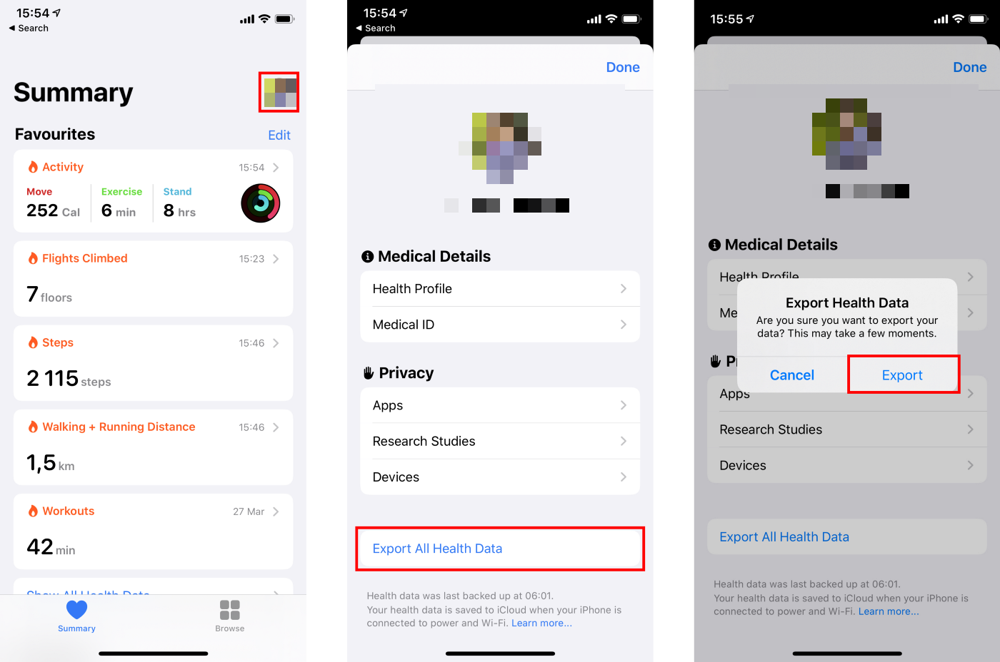

# iPhone Health Data Processing
This is a simple data processing project that reads health data exported from the iPhone Health app and processes it. 

To export the data from the iPhone Health app, follow these steps:

<p align="center">

</p>

The data will be exported as a zip file. Unzip the file. The data will be stored in a XML file.

The data processing is done in the `src/pipeline.py` file. 
Relevant columns are processed and stored in a CSV file. The user can specify the frequency of the data.

Usage:
```bash
python -m src.pipeline -i path/to/input/data -o desired/path/for/output/data -f <desired frequency of the data>
```
